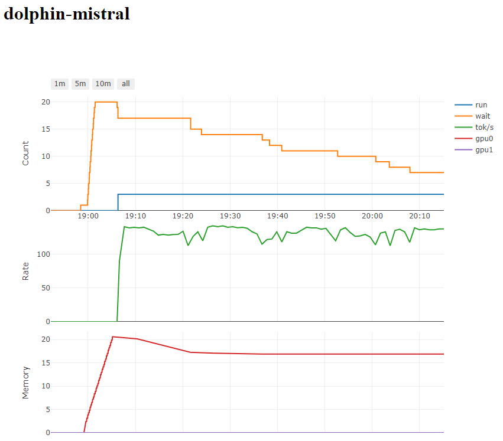

# ExLlamaV2-OpenAI-Server

An implementation of the OpenAI API using the ExLlamaV2 backend.
This project is not affiliated with ExLlamaV2 or OpenAI.

## Features

* Continuous batching.
* Streamed responses.
* OpenAI compatibility for `/v1/models` and `/v1/chat/completions` endpoints
* Uses Ollama model metadata information to set default prompting and parameters.
* Remembers your settings per model.
* Loads models on demand.
* Status endpoint with graphs! (and nothing else)

I've been testing against the python openai module, [Ollama Web UI](https://github.com/ollama-webui/ollama-webui) and [continue.dev](https://continue.dev/).

## Origin Story

This wouldn't be possible without [ExLlamaV2](https://github.com/turboderp/exllamav2) or EricLLM. I saw [EricLLM](https://github.com/epolewski/EricLLM) and thought it was close to
doing what I wanted, and by the time I realized what I was doing, I had pretty much completely rewritten it.

My goals are to be able to figure out how to set up a model once (preferably by leveraging work by the Ollama team) and then easily use it in a variety of frontends without thinking about it again. However, I also like to be able to quantize things to meet specific memory goals, and I like the performance of ExLlamaV2. Hence this project.

## Issues

* I have no idea what I'm doing.
* To combat creeping VRAM usage over time it is aggressively calling `torch.cuda.empty_cache()` which definitely has a performance impact, but it's better than running out of VRAM.
* It's currently streaming everything internally, which is almost certainly slowing down non-streaming requests.
* The ExLlamaV2 class `ExLlamaV2StreamingGenerator` has too much important stuff in it to avoid using it, but it also wasn't meant to be used this way.
* Model loading is synchronous, prompt parsing is synchronous, token decode is serialized with model inference, ...

## Installation

```
git clone https://github.com/bjj/exllamav2-openai-server
cd exllamav2-openai-server
pip install -r requirements.txt
```

Notes:
* Tested on python 3.11.7. 3.12+ seems to have version conflicts.
* First start will take a long time to compile `exllamav2_ext`.

## Adding Models

To add a new model:

1. Download a ExLlamaV2 compatible model (EXL2 or GPTQ)
2. Browse the [Ollama Library](https://ollama.ai/library) to find the matching repository. This is where we'll get prompt information and other default settings.
3. Run `python create_model.py --model-dir <path_to_exl2> <repository[:tag]>`
4. Repeat for as many models as you want to use

Note that tags are optional and often have the same metadata in the Ollama library. You can use them for yourself to give models unique names, for example `deepseek-coder:6.7b` and `deepseek-coder:33b`. This never downloads the GGUF files used by Ollama, so it doesn't matter what their default quantization is or what quantization tag you choose. **The quantization is determined by what EXL2 or GPTQ you download for yourself.**

You can also pass options to `create_model.py` to override options provided by Ollama. For example, to add Mixtral-8x7B-Instruct, with a model in `E:\...`, prompting from Ollama, but with batching limited to 1 and context limited to 16k (for memory):

```
python .\create_model.py --model-dir E:\exl2-llm-models\turboderp\Mixtral-8x7B-instruct-3.5bpw-exl2\ --max-batch-size 1 --max-seq-len 16384 mixtral
```

You can add models while the server is running. It reads the `models.json` file again whenever it needs to know about the models.

## Running the Server

You can run the server with no arguments. It will listen on `0.0.0.0:8000` by default:

```
python server.py
```

The server takes several optional arguments. The options used are selected with the following priority:

1. The options provided in the API request (if they don't exceed limits)
2. The `server.py` command line arguments
3. The `create_model.py` command line arguments
4. The Ollama repository configuration data
5. The model's `config.json`

For example, you pass `--max-batch-size 8` to the server. You get a batch size of 8 even though the model (see example above) was limited to `--max-batch-size 1`.

You can do a quick test with `curl http://localhost:8000/v1/models`

## Monitoring

There is a simple webpage at `http://localhost:8000/`



## Multi GPU

You can manually specify the memory split with `--gpu_split`, but it's very finicky to get right. Otherwise it will use ExLlamaV2's automatic splitting. Note that the auto splitting works by allocating as much memory as it will ever need for maximum context length and batch size. This is how it knows where to split. If you run out of memory loading with automatic splitting, you should reduce batching or context length (which you can do per-model) or try the 8bit cache. If you use manual splitting to avoid the initial OOM, you are just risking OOM later.